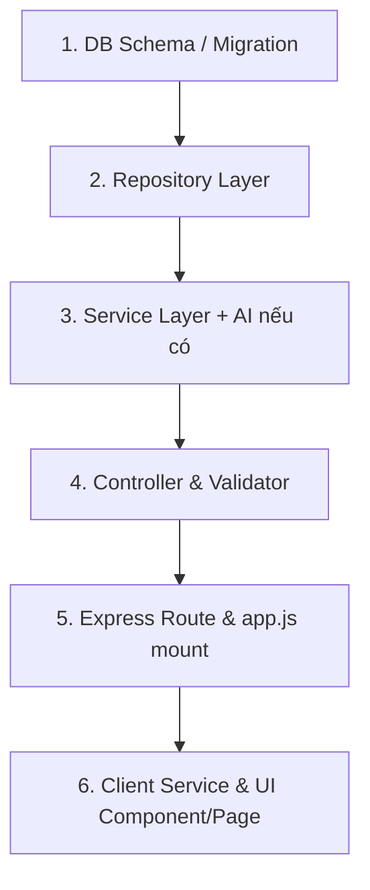

# EngVantage Course Platform - Codebase Architecture & Extension Skill

Hệ thống kiến trúc chuẩn (Codebase Standard) và quy chuẩn phát triển (Development Guidelines) dùng xuyên suốt cho dự án **EngVantage AI** (AI-Powered English Learning Platform).

Kỹ năng này bảo đảm mọi tính năng mới được thêm vào đều **tuân thủ tuyệt đối cấu trúc phân lớp (Clean Layered Architecture)**, giữ gìn tính toàn vẹn hệ thống và không phá vỡ cấu trúc hiện tại.

---

## 🏛️ 1. Tổng quan Kiến trúc Toàn Hệ Thống

```text
Course/
├── client/                     # Frontend: React 19 + Vite + Tailwind CSS + Lucide
│   ├── src/
│   │   ├── components/         # Reusable UI & Layout components
│   │   ├── context/            # Global state (Auth, Language, Theme)
│   │   ├── locales/            # i18n localization dictionaries (vi.js, etc.)
│   │   ├── pages/              # Route entry pages
│   │   ├── services/           # HTTP API client services (apiRequest wrappers)
│   │   ├── App.jsx             # React Router routing & ProtectedRoute wrapper
│   │   ├── main.jsx            # React root mount
│   │   └── index.css           # Tailwind base styles
│   └── package.json
│
├── server/                     # Backend: Node.js (ESM) + Express + Supabase + Gemini
│   ├── src/
│   │   ├── ai/                 # Google Gemini AI integrations
│   │   │   ├── prompts/        # Prompt builder functions
│   │   │   ├── schemas/        # Zod structured output validation schemas
│   │   │   └── ai.service.js   # Gemini caller + deterministic fallback
│   │   ├── config/             # Config & external clients (index, supabase, gemini)
│   │   ├── controllers/        # Express HTTP handlers (req/res mapping)
│   │   ├── db/                 # SQL schemas & database seeders
│   │   ├── middlewares/        # Auth (JWT), Error handler, Rate limiting
│   │   ├── repositories/       # Supabase PostgreSQL data access layer
│   │   ├── routes/             # Express Routers (/api/...)
│   │   ├── services/           # Core business logic & orchestration
│   │   ├── utils/              # Utilities (response.js, helpers)
│   │   ├── validators/         # Input validation schemas (Zod)
│   │   ├── app.js              # Express app configuration & middleware mounts
│   │   └── server.js           # HTTP server initialization
│   └── package.json
│
└── .agents/                    # Agent Skills & Workspace Configurations
    └── skills/
        ├── course-codebase/    # This skill (Arch & codebase patterns)
        └── supabase/           # Supabase database & auth reference
```

---

## 🔒 2. Các Quy Tắc Vàng (Golden Rules - Không Được Phá Vỡ)

1. **Nguyên tắc "Không sửa phá cấu trúc cũ"**:
   - Khi thêm tính năng mới, luôn tạo mới file theo đúng lớp tương ứng thay vì nhồi nhét vào các controller/service hiện có.
   - Giữ nguyên hợp đồng dữ liệu (API response contract) và quy ước đường dẫn API.
2. **Quy tắc phân tầng Backend (Strict Layering)**:
   - `Route` chỉ định nghĩa URL và gán middleware + controller. Không viết logic trong Route.
   - `Controller` chỉ bóc tách `req.params`, `req.body`, `req.user`, gọi `Service` và trả về `successResponse` hoặc `errorResponse`. Không gọi trực tiếp `supabase` trong Controller.
   - `Service` chứa toàn bộ nghiệp vụ (business logic). Điều phối giữa các Repository và AI Service.
   - `Repository` là nơi duy nhất được tương tác trực tiếp với `supabase`.
   - `AI Service` luôn phải có **Zod schema validation** và **Deterministic Fallback** khi Gemini API gặp lỗi hoặc thiếu key.
3. **Quy tắc Frontend (Client-side conventions)**:
   - Các trang mới phải nằm trong `client/src/pages/` và được đăng ký tại `client/src/App.jsx`.
   - Các API call không được dùng `fetch` trần trong component, mà phải thông qua `client/src/services/api.js` (`apiRequest`) và được đóng gói trong file service tương ứng (e.g., `xxxService.js`).
   - Các trang bảo mật bắt buộc phải được bọc trong `<ProtectedRoute>`.
   - Màu sắc và giao diện theo phong cách sang trọng hiện đại: Dark mode / Slate-Indigo palette, glassmorphic card, rounded corners (`rounded-2xl`, `rounded-xl`), Lucide icons.

---

## 🛠️ 3. Quy Trình Chuẩn Khi Thêm Tính Năng Mới (Step-by-step Workflow)

Mỗi khi người dùng yêu cầu thêm 1 chức năng mới (Ví dụ: Flashcard, Speaking Test, Chatbot, v.v.), hãy tuân thủ tuần tự 6 bước sau:



### Bước 1: Thiết kế Cơ sở dữ liệu (Database Schema)
- File cập nhật: [schema.sql](file:///d:/Course/server/src/db/schema.sql)
- Tuân theo cấu trúc bảng của Supabase PostgreSQL (UUID primary keys, foreign key cascade, timestamp `created_at`, `updated_at`).

### Bước 2: Tạo Repository Layer
- Thư mục: `server/src/repositories/<feature>.repository.js`
- Mẫu chuẩn:
```javascript
import { supabase } from '../config/supabase.js';

export const featureRepository = {
  async getByUserId(userId) {
    if (!supabase) return [];
    const { data, error } = await supabase
      .from('table_name')
      .select('*')
      .eq('user_id', userId)
      .order('created_at', { ascending: false });

    if (error) throw error;
    return data;
  },

  async create(itemData) {
    if (!supabase) return null;
    const { data, error } = await supabase
      .from('table_name')
      .insert([itemData])
      .select()
      .single();

    if (error) throw error;
    return data;
  }
};
```

### Bước 3: Tạo Service Layer (và Tích hợp AI nếu cần)
- Thư mục: `server/src/services/<feature>.service.js`
- Xử lý nghiệp vụ, kiểm tra quyền sở hữu, tính toán điểm hoặc gọi `aiService`.
- Nếu có AI:
  1. Viết hàm build prompt tại `server/src/ai/prompts/<feature>.prompt.js`.
  2. Định nghĩa Zod schema tại `server/src/ai/schemas/<feature>.schema.js`.
  3. Thêm phương thức vào `server/src/ai/ai.service.js` kèm deterministic fallback.

### Bước 4: Tạo Controller & Validator
- Thư mục: `server/src/controllers/<feature>.controller.js`
- Mẫu chuẩn:
```javascript
import { featureService } from '../services/feature.service.js';
import { successResponse, errorResponse } from '../utils/response.js';

export const getItems = async (req, res) => {
  try {
    const userId = req.user.id;
    const result = await featureService.getUserItems(userId);
    return successResponse(res, result, 'Lấy danh sách thành công');
  } catch (error) {
    const statusCode = error.statusCode || 500;
    return errorResponse(res, error.message, statusCode);
  }
};
```

### Bước 5: Tạo Route & Mount vào Server
- Thư mục: `server/src/routes/<feature>.route.js`
```javascript
import { Router } from 'express';
import { requireAuth } from '../middlewares/auth.middleware.js';
import { getItems } from '../controllers/feature.controller.js';

const router = Router();

router.use(requireAuth); // Nếu tính năng yêu cầu đăng nhập
router.get('/', getItems);

export default router;
```
- Mount tại [app.js](file:///d:/Course/server/src/app.js):
```javascript
import featureRouter from './routes/feature.route.js';
// ...
app.use('/api/features', featureRouter);
```

### Bước 6: Frontend Service, Route & UI
1. **Tạo Client Service**: `client/src/services/<feature>Service.js`
```javascript
import { apiRequest } from './api.js';

export const featureService = {
  async getItems() {
    return await apiRequest('/api/features');
  },
  async createItem(payload) {
    return await apiRequest('/api/features', {
      method: 'POST',
      body: JSON.stringify(payload)
    });
  }
};
```
2. **Tạo Trang Page**: `client/src/pages/<FeatureName>.jsx`
   - Dùng `useAuth()` từ [AuthContext.jsx](file:///d:/Course/client/src/context/AuthContext.jsx).
   - Dùng component Header ([Header.jsx](file:///d:/Course/client/src/components/Header.jsx)).
   - Có trạng thái `isLoading`, `error`, giao diện hiện đại đồng bộ.
3. **Đăng ký Route**: Thêm `<Route>` vào [App.jsx](file:///d:/Course/client/src/App.jsx).

---

## 📋 4. Chuẩn Format Dữ Liệu API (API Response Contract)

Mọi endpoint backend đều phải trả về định dạng JSON thống nhất qua `src/utils/response.js`:

### Response thành công (HTTP 200, 201)
```json
{
  "status": "success",
  "message": "Nội dung thông báo thành công",
  "data": { ... }
}
```

### Response thất bại (HTTP 400, 401, 403, 404, 500)
```json
{
  "status": "error",
  "message": "Mô tả lỗi chi tiết cho client",
  "errors": [ ... ]
}
```

---

## 🧩 5. Tài liệu Mẫu Tham Khảo Chi Tiết (References)

Để xem chi tiết code mẫu đầy đủ của từng layer, hãy tham khảo các file tài liệu đính kèm:
- [Backend Patterns Reference](file:///d:/Course/.agents/skills/course-codebase/references/backend_patterns.md)
- [Frontend Patterns Reference](file:///d:/Course/.agents/skills/course-codebase/references/frontend_patterns.md)
